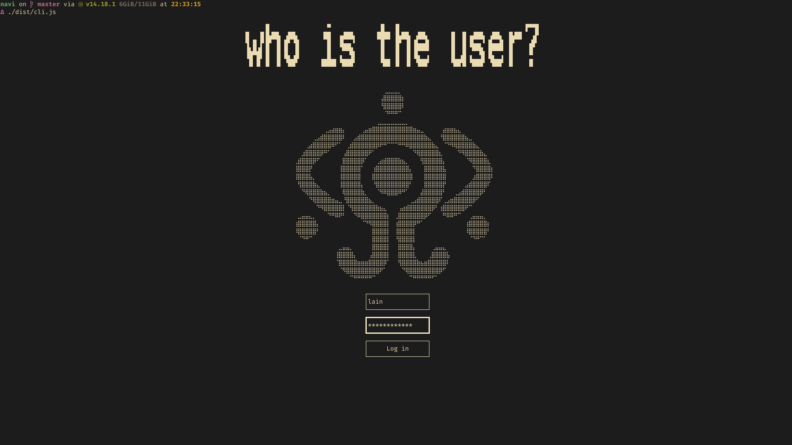
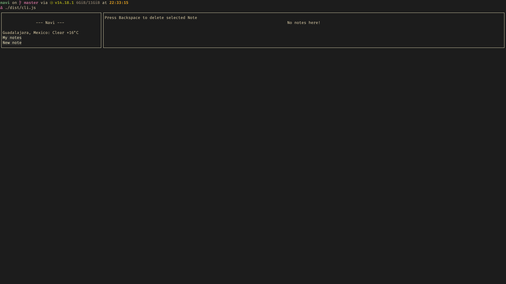
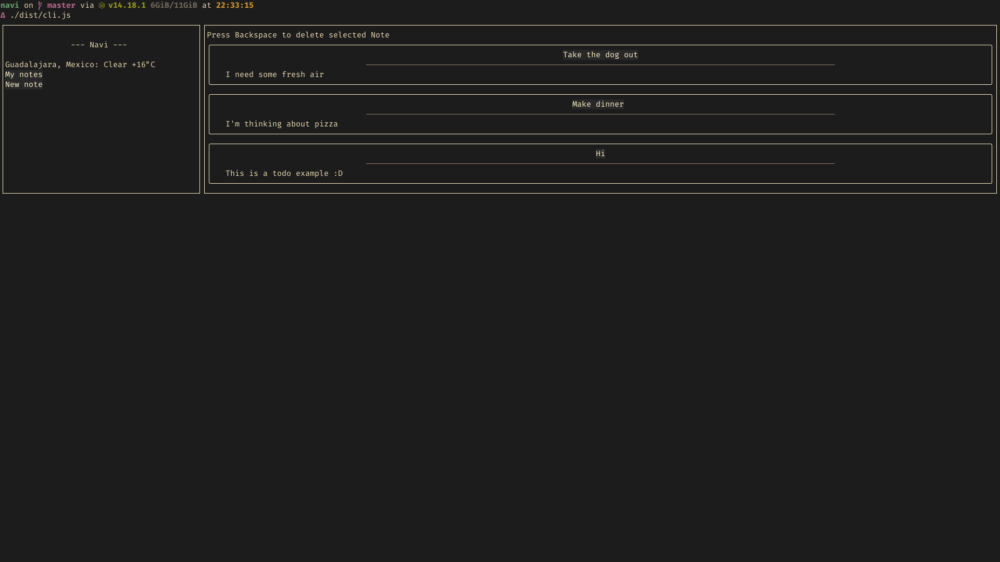
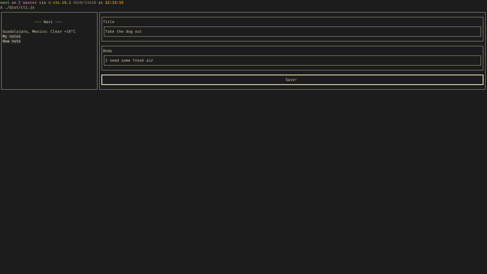
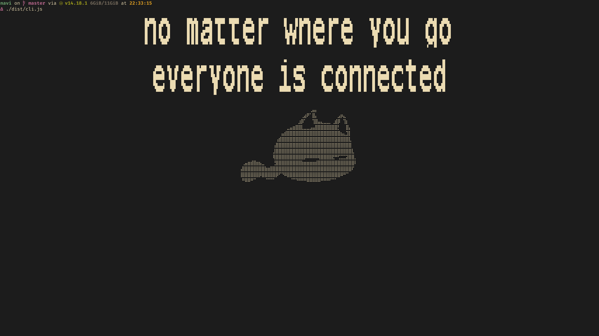

# The over-engineered ToDo app

## Navi
Navi is the typical React ToDo app with a twist... It runs in the terminal!\
[Backend made with AdonisJS framework and PostgreSQL](https://github.com/mluna711/navi-backend)

### Screenshots

#### Login Screen

#### Home Screen (without notes)

#### Home Screen

#### New Note Screen

#### Goodbye screen (because why not?)

### How to run it locally

1. Clone the repo
2. Inside the local repo run `yarn install`
3. Run `yarn start`

* * *
**Made with ♥ in 2021**
